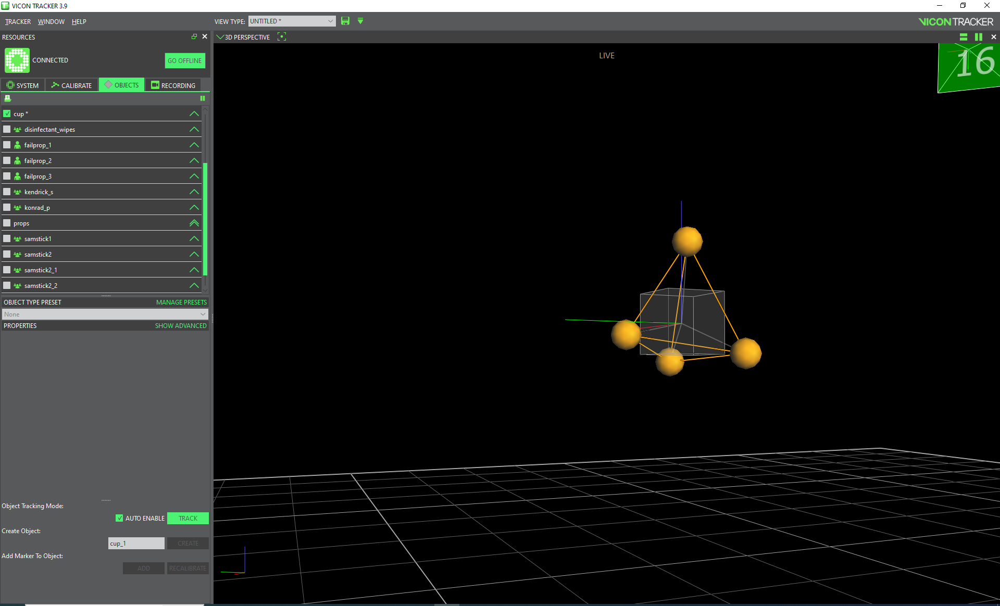
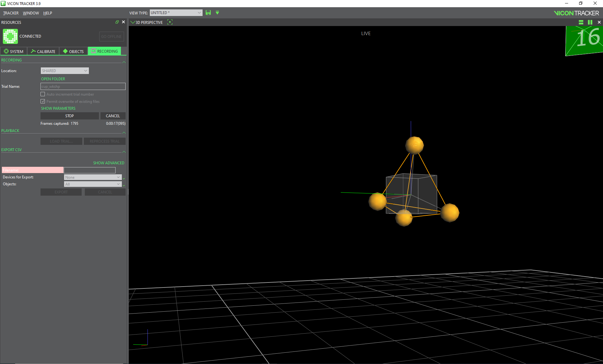

# Recording an object

Make sure the system is calibrated and all vantage cameras in the view pane are green and tracker is in Live mode.

- Check to make sure the object(s) you want to track are checked in the object pane and are visible in the view pane.
- Select the Recording tab in the resources pane
- In the Location area select whether the recording would be shared or private, we usually set to shared.
- Name the recoding in the Trial Name area

- Click the record button when you are ready to record

*if you see “No Trial” in the view pane, click the “Go Live” button in the Resources Pane on the left of the application window.*

*On the CCAM Mo-Cap pc, Vicon Trial recordings are saved in this directory
  C:\Users\Public\Documents\Vicon\Tracker3.x\CapturedTrials*