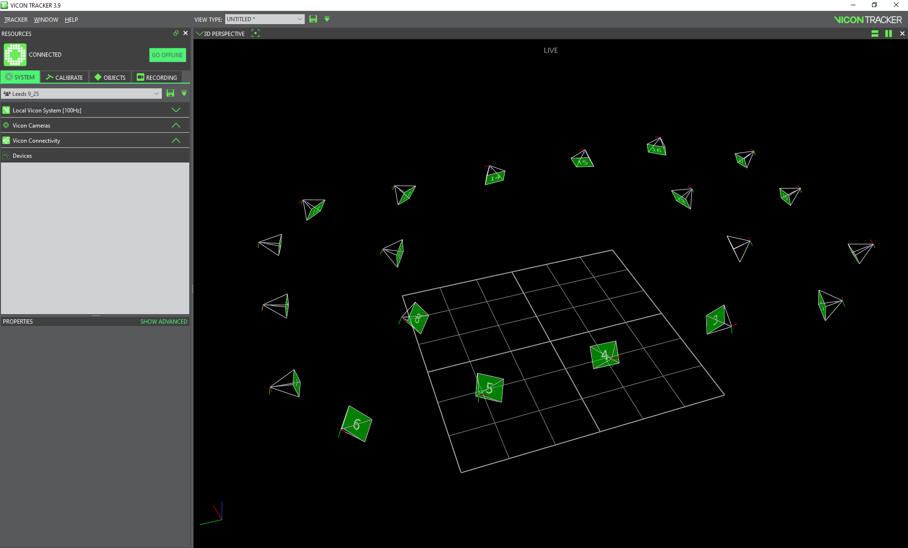

# Navigating the view pane

- Holding a right-click and moving the mouse up or down zooms in and out into the view pane
- Holding a left-click and moving the mouse moves the view orientation in the view pane
- Holding the scroll button down and moving the mouse pans the view to the direction of the mouse.